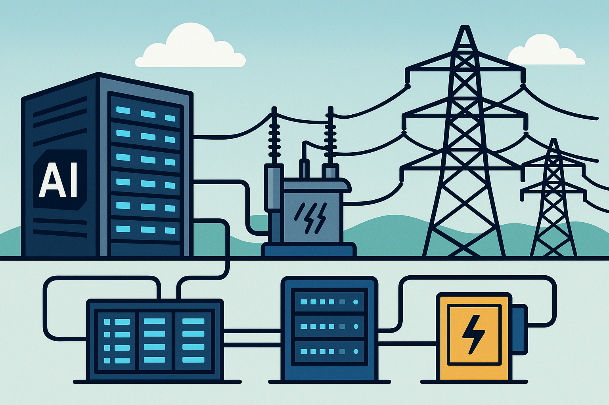

  

# AI Data Center Power Grid Integration Analysis

This repository provides the code and simulations to accompany the survey paper, "Survey: Technical Challenges of AI Data Center Integration into the Power Grid." [cite: 3]

The objective of this project is to:
1.  **Characterize** the unique power consumption profiles of AI workloads (training and inference) at a high-resolution, millisecond timescale.
2.  **Demonstrate** the volatile nature of these workloads, specifically the rapid power fluctuations caused by cycling between computation and communication phases.
3.  **Simulate** the impact of these realistic, fluctuating AI loads on power grid stability, focusing on frequency and rotor angle dynamics.

---

## 🚀 Workflow & How to Run

This project is divided into three main parts. The scripts must be run in order, as they are dependent on each other.

### Part 1: GPU Power Data Aggregation

This step captures the real-world power profile of an AI workload.

* **Script:** `gpu_power_profile_monitoring.ipynb`
* **Environment:** Python 3 (in a Google Colab or local environment with a NVIDIA GPU).
* **Objective:** To run a real AI model (ResNet50) and use `nvidia-smi` to monitor its power draw, utilization, and temperature at a 50ms interval.
* **Key Feature:** The script tags every data sample with the GPU's operational state (e.g., `forward_pass`, `backward_pass`, `communication`, or `waiting_for_queries`).
* **Output:** This will generate two key data files:
    * `training_metrics_with_states.csv`
    * `inference_metrics_with_states.csv`

### Part 2: Workload Power Profile Visualization

This step visualizes the data captured in Part 1 to reproduce the paper's workload characterization.

* **Script:** `gpu_power_profile_visualization.m`
* **Environment:** MATLAB
* **Objective:** To load the `.csv` files and create publication-quality figures.
* **Analysis:** This script generates three figures:
    1.  **Training Metrics:** A 2x2 plot showing Power, Temperature, Utilization, and Memory over time for the training workload.
    2.  **Inference Metrics:** A 2x2 plot for the inference workload.
    3.  **Power Comparison:** A side-by-side plot that color-codes the power draw based on the GPU's operational state, visually capturing the transitions between compute and communication.

### Part 3: Grid Stability Simulation

This is the main simulation, which links the real-world AI workload from Part 1 to existing grid stability challenges.

* **Script:** `DataCenter.m`
* **Environment:** MATLAB (with Simulink)
* **Objective:** To analyze the impact of the volatile AI training load on the frequency and angle stability of a synchronous generator.
* **Methodology:**
    1.  The script **loads `training_metrics_with_states.csv`** to use as a realistic, time-varying load input (`PLstep`) for the power system model.
    2.  It simulates a local synchronous generator connected to the grid, feeding this fluctuating AI load.
    3.  It performs a **parameter sweep on the damping coefficient (`alpha`)** to analyze the system's dynamic response.
* **Output:** This script generates several plots, including:
    * **Time-Domain Response:** Shows the generator's Power (P), frequency (f), and rotor angle ($\delta$) oscillating in response to the AI load.
    * **Phase-Plane Portrait:** Visualizes the stability of the system.
    * **Parametric Analysis:** Quantifies how stability metrics (like settling time and frequency nadir) change with different damping values.

---

## 📊 Summary of Results

This analysis demonstrates the distinct difference between AI loads and traditional, more stable loads.

1.  **AI Workloads are Highly Volatile:** The results from `gpu_power_profile_visualization.m` demonstrate that AI training is not a constant load; it shows rapid, large-scale power fluctuations as the GPU cycles between high-power compute phases (forward/backward pass) and low-power communication phases.

2.  **Workload Volatility Causes Grid Instability:** The simulations from `DataCenter.m` show that this fluctuating AI load profile acts as a disturbance to the grid. It injects "noise" that **induces significant oscillations in the grid's frequency and the generator's rotor angle**.

3.  **System Damping is Critical:** The parametric sweep shows that without adequate damping (low `alpha`), the generator's frequency and angle become highly unstable, which could lead to cascading failures. This confirms that the unique signature of AI workloads poses a direct risk to system stability that must be managed by grid operators and data center hardware.
